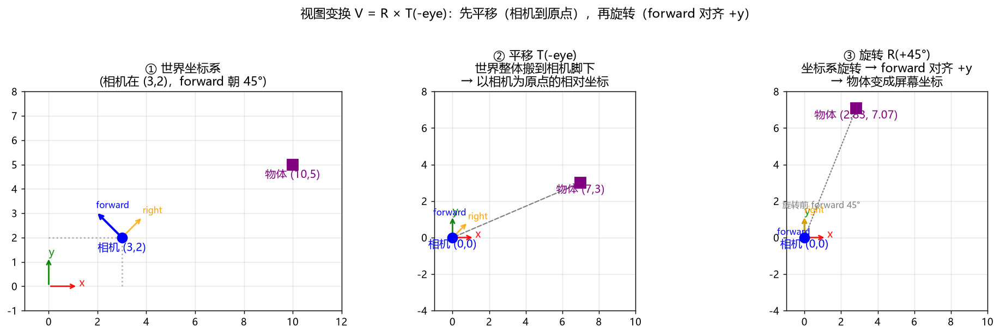
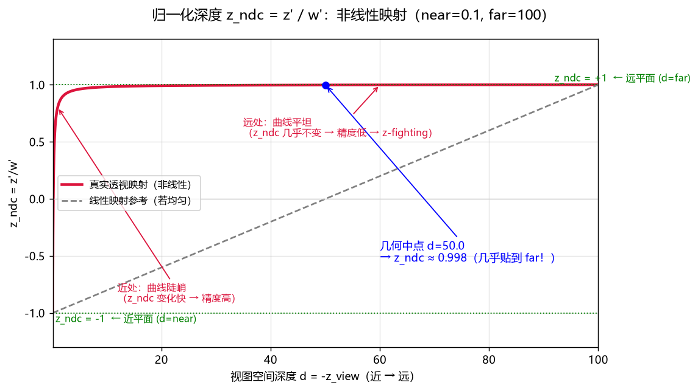
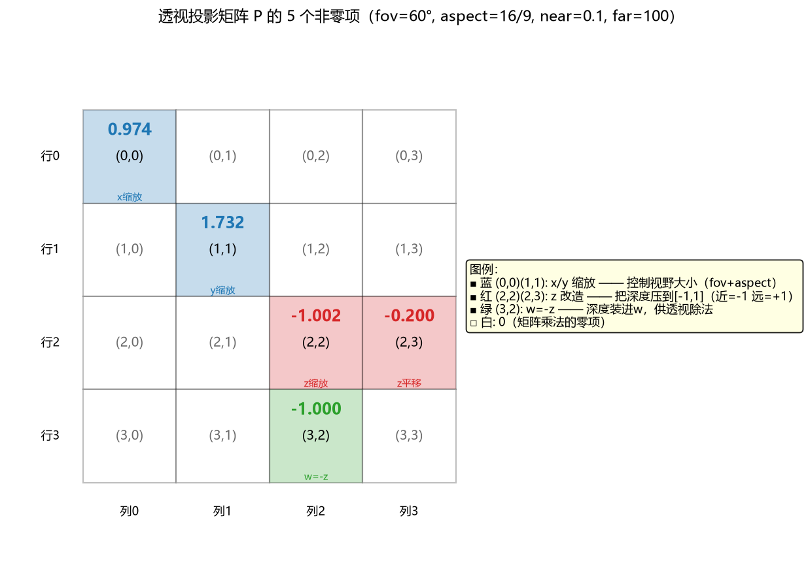
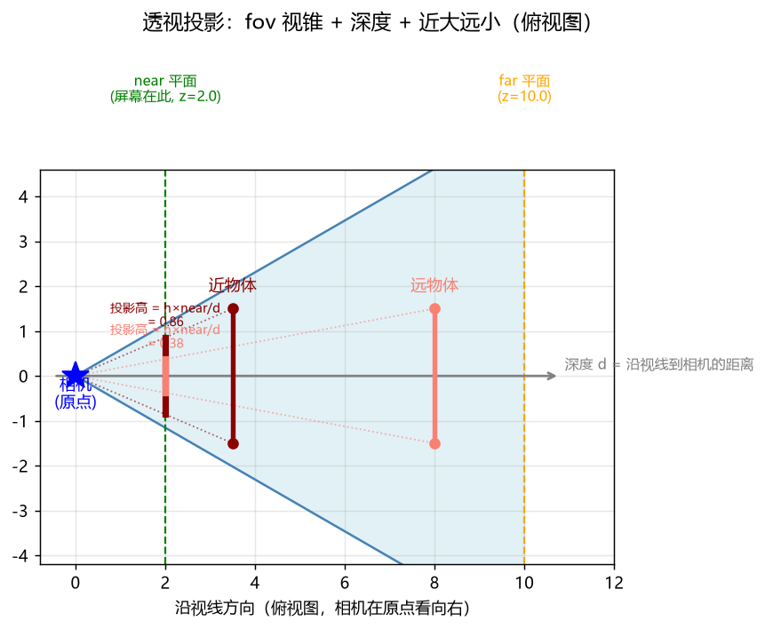
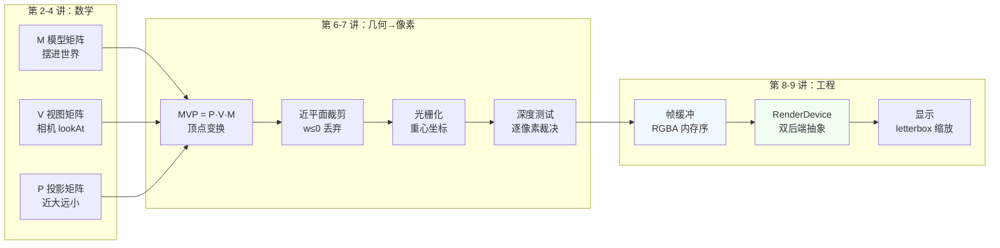

# 渲染系统教学笔记（从 2D 心智模型到 3D 管线）

> 面向：已有 2D 游戏开发经验（JS 网游：容器 / Surface / 摄像头 三层模型）、首次实现 3D 渲染系统。
> 目标：从读者已有的概念出发，逐步建立 3D 渲染管线的完整心智模型。

---

## 第 1 讲：你的三层模型 = 渲染管线的骨架

### 1.1 三层模型回顾（读者已有的）

```
容器（网页上的屏幕，像素网格）
   ↑ 摄像头把世界"搬"进来：以 surface 中心为基准，二维偏移 + 放缩
Surface（世界画布：emoji、纹理、背景、遮挡形状）
   ↑ 内容少 → 直接全量渲染整个世界到 surface 上
```

摄像头做的事（数学）：`屏幕位置 = (世界位置 − 摄像头位置) × 放缩`

### 1.2 三层模型 = 渲染三大阶段

| 你的名字 | 渲染术语          | 负责什么               |
| -------- | ----------------- | ---------------------- |
| 容器     | 屏幕 / 视口       | 最终显示像素的地方     |
| Surface  | 世界空间 + 帧缓冲 | 场景内容摆在哪、画在哪 |
| 摄像头   | 相机（视图变换）  | 世界怎么映射到屏幕     |

视角差异：读者从外往里看（屏幕→世界→相机）；渲染工程师从里往外看（世界→相机→屏幕）。同一件事，方向不同。

### 1.3 为什么 2D 渲染能这么简单

1. 世界是**平面**（都在 z=0）：不存在深度遮挡，后来者覆盖先画者即可
2. 内容**少**：每帧全量重画扛得住

3D 这两条都不成立 → 需要**投影**（近大远小）和**深度缓冲**（深度遮挡）。这是 2D 模型里"因为平面、因为内容少"而根本不需要的两样东西。

### 1.4 已完成 60%

```
世界（surface） → 相机（摄像头） → 屏幕（容器）
       ✅              ✅              ✅
```

缺的 40% 全是"加 z 维度"引发：摄像头要处理朝向+近大远小；全量渲染要处理深度遮挡；现成图片要现场算出内容。

---

## 第 2 讲：摄像头 = 一个坐标变换（平移+缩放写成矩阵）

### 2.1 摄像头 = 两个连续操作

```
屏幕 = (世界 − 摄像头位置) × zoom
```

1. **平移**：世界每个点减摄像头位置 → 把世界搬到摄像头脚下（假装摄像头是原点）
2. **放缩**：乘以 zoom

贯穿例子：物体 (10,5)，摄像头 (3,2)，zoom=2 → 屏幕 (14,6)。

### 2.2 为什么平移写不进 2×2 矩阵

2×2 矩阵乘法只能做"x 的若干倍 + y 的若干倍"，产生不了 `+tx` 这种常数项。**平移不是线性变换。**

### 2.3 解法：升维（齐次坐标）

点从 `(x,y)` 升成 `(x,y,1)`，矩阵从 2×2 变 3×3。末尾恒为 1 的第 3 维专门用来装平移：

平移矩阵：

$$
T = \begin{bmatrix} 1 & 0 & t_x \\ 0 & 1 & t_y \\ 0 & 0 & 1 \end{bmatrix}
$$

放缩矩阵：

$$
S = \begin{bmatrix} 2 & 0 & 0 \\ 0 & 2 & 0 \\ 0 & 0 & 1 \end{bmatrix}
$$

### 2.4 两步合并成一个矩阵

先平移再缩放 → 把两个矩阵乘在一起，一个矩阵装下整个摄像头：

$$
C = S \times T = \begin{bmatrix} 2 & 0 & -6 \\ 0 & 2 & -4 \\ 0 & 0 & 1 \end{bmatrix}, \qquad
C \begin{bmatrix} 10 \\ 5 \\ 1 \end{bmatrix} = \begin{bmatrix} 14 \\ 6 \\ 1 \end{bmatrix}
$$

### 2.5 顺序口诀

> **先做的靠右，后做的靠左**（列向量约定：`v' = C·v`，从右往左读）

### 2.6 为什么这是 3D 的钥匙

1. 平移要升维（2D 用 3×3 → 3D 用 4×4，即 `Matrix4x4`）
2. 多个变换可合并成一个矩阵（`Matrix4x4::operator*`）
3. 一个矩阵 = 一个完整的"摄像头"（3D 里叫视图矩阵 V）

---

## 第 3 讲：从 2D 到 3D——摄像头升维

### 3.1 升维

- 点 `(x,y,1)` → `(x,y,z,1)`：3 个空间坐标 + 1 个齐次 1
- 矩阵 3×3 → **4×4**（`Matrix4x4`）
- surface 从"平面"变"空间"，emoji 有了前后

### 3.2 摄像头三变化

| 2D 摄像头       | 3D 摄像头        | 变化                |
| --------------- | ---------------- | ------------------- |
| 偏移（2D 平移） | 位置（3D 平移）  | 多一个 z 方向       |
| 缩放（zoom）    | 投影（近大远小） | 本质改变（第 4 讲） |
| （无）          | 朝向（能转头）   | 全新能力            |

2D 摄像头不需要朝向：2D 世界摄像头永远垂直于平面看。3D 相机可朝任意方向。

### 3.3 4×4 平移矩阵（位置）

$$
T = \begin{bmatrix} 1 & 0 & 0 & t_x \\ 0 & 1 & 0 & t_y \\ 0 & 0 & 1 & t_z \\ 0 & 0 & 0 & 1 \end{bmatrix}
$$

例：相机 (3,2,5)，物体 (10,5,0) → 平移后 (7,3,-5)。**物体在相机前方 = z 为负**（OpenGL 约定）。

### 3.4 朝向 = `lookAt`

`math::lookAt(eye, target, up)` 返回完整 4×4 矩阵，同时含位置（平移）+ 朝向（旋转）。心里可一直叫它"摄像头矩阵"。

### 3.5 MVP 预告

- **M**：物体自己的变换（第 2 讲思路）
- **V**：摄像头矩阵（本讲）
- **P**：投影（第 4 讲）

### 3.6 库已就绪

| 3D 摄像头需要      | 库                            | 状态        |
| ------------------ | ----------------------------- | ----------- |
| 4×4 矩阵 + 乘法    | `Matrix4x4` + `operator*`     | ✅ 301 断言 |
| 齐次坐标/w 除法    | `operator*(Vector3)` 自动处理 | ✅          |
| 平移/缩放/旋转组合 | `math::trs()`                 | ✅          |
| 摄像头矩阵         | `math::lookAt()`              | ✅          |

---

## 插讲 A：朝向是什么

### 定义

> 位置 = 你在哪；朝向 = 你的脸朝哪。

两个独立信息。3D 摄像头要回答"看到什么画面"，必须同时知道两者。

### 读者已有经验

2D 角色的 facing、发射子弹方向 `normalize(mouse - player)`——都是朝向。

### 为什么 2D 摄像头不需要、3D 必须

- 2D：摄像头永远垂直于平面 → 朝向被固定死，不用操心
- 3D：同一位置不同朝向 = 完全不同画面（相机 (0,0,5)：看原点 / 回头看 / 朝左看，画面天差地别）

### 朝向的三种写法（同一件事）

| 写法     | 形式                                | 对应库                      |
| -------- | ----------------------------------- | --------------------------- |
| 目标点   | `f = normalize(target - eye)`       | `lookAt` 用                 |
| 方向向量 | `Vector3 forward = {0,0,-1}`        | 直接可用                    |
| 旋转     | `Quaternion`（姿态 = 朝向的正式名） | `lookRotation(forward, up)` |

"姿态"就是"朝向"的正式名字（见 ADR-0009：内部 S³ 四元数）。

### 还需要 up（头顶方向）

光有"脸朝哪"不够——脸朝前但头可左歪右歪（歪头杀）。`lookAt` 第三参数 up 用于摆正画面。默认传世界"上"即可。

---

## 插讲 B：平移 + 朝向怎么合进一个矩阵

### 平移和旋转是两件独立的事

一个 4×4 矩阵同时装：平移部分（右上 3 个数，管"放在哪"）+ 旋转部分（左上 3×3，管"脸朝哪"）。

### 顺序决定"绕谁转"（读者 canvas 经验）

```js
ctx.translate(x, y); // 先平移
ctx.rotate(angle); // 再旋转
```

先 translate 再 rotate → 绕自己中心转。反了会绕屏幕原点转飞出去。**旋转永远绕原点转。**

### 摄像头：先平移、后旋转

```
第 1 步：平移 —— 把整个世界搬走，让相机落到原点
第 2 步：旋转 —— 把世界转到"相机朝向对齐"
```

因为旋转绕原点转，必须先平移把相机搬到原点，旋转才会"以相机为轴心"。

$$
V = R \times T(-eye)
$$

### 数字例子（2D 简化）

相机 (3,2) 朝 45°，物体 (10,5)：

1. 平移：物体 → (7,3)（相机为原点的相对坐标，管"距离"）
2. 旋转 +45°：forward 45° → 对齐 +y；物体 → (2.83, 7.07)（管"方向"）

**平移管距离，旋转管方向，各管各的，按序组合。**

### 精确化：旋转的是坐标系

旋转 R = 把"以相机为原点的坐标系"整体旋转，直到 forward 与目标轴对齐（OpenGL: -z；2D 教学: +y）。物体坐标随坐标系旋转。

数学：$R = R_{cam}^{-1} = R_{cam}^T$（纯旋转的逆 = 转置）——把"相机的 forward 45°"旋回"对齐 +y"。

### 配套图

见 ：①世界坐标系 → ②平移（相机到原点，物体 (7,3)）→ ③旋转（forward 对齐 +y，物体 (2.83,7.07)）。

---

## 已建立的心智模型（本笔记小结）

1. 渲染 = 世界 → 相机 → 屏幕 的降维流水线
2. 一个矩阵 = 一个完整的摄像头（平移 + 朝向合并）
3. 顺序口诀：**先做的靠右，后做的靠左**
4. 平移管距离、旋转管方向
5. 2D 到 3D 只是升维：3×3 → 4×4，平面 → 空间
6. 数学全部就绪于 `core/math`（301 断言已验证）

---

## 第 4 讲：投影——你的 zoom 在 3D 里变成了什么

### 4.1 为什么 zoom 不够了

2D 摄像头 `屏幕 = 世界 × zoom`：所有物体在同一平面，一个 zoom 对谁都公平。3D 物体有近有远，**每个物体的"缩放"必须取决于它离相机多远**（近大远小）。

### 4.2 针孔相机模型（直觉来源）

相似三角形：$h' = \frac{f \cdot h}{d}$——**像的大小与距离成反比，这就是近大远小的数学本质：除以深度。**

### 4.3 3D 摄像头 = 2D 摄像头换掉 zoom

|      | 2D        | 3D                   |
| ---- | --------- | -------------------- |
| 缩放 | 常量 zoom | 除以深度（近大远小） |

### 4.4 正交 vs 透视

|          | 正交投影                    | 透视投影  |
| -------- | --------------------------- | --------- |
| 缩放方式 | 常量 zoom（=2D 摄像头升维） | 除以深度  |
| 平行线   | 永远平行                    | 汇聚      |
| 效果     | 工程图/俯视图               | 照片/人眼 |

### 4.5 关键：矩阵乘法里怎么做除法？→ 齐次坐标 w

矩阵只会乘加，做不了除法。解法：**投影矩阵 P 把深度装进 w**（P 第 4 行 `(0,0,-1,0)`），然后透视除法除以 w：

$$
P \begin{bmatrix} x \\ y \\ z \\ 1 \end{bmatrix} = \begin{bmatrix} x' \\ y' \\ z' \\ w' \end{bmatrix}, \quad w' = -z, \quad 屏幕 = \frac{x'}{w'}
$$

P 一次做四件事：缩放 x、缩放 y、映射 z 到 [-1,1]（供深度缓冲）、把深度装进 w。

### 4.6 库已就绪

```cpp
math::Matrix4x4 P = math::perspective(fovY, aspect, near, far);   // 透视
math::Matrix4x4 P2 = math::orthographic(l, r, b, t, near, far);   // 正交
```

### 4.7 MVP 凑齐

```cpp
math::Matrix4x4 mvp = P * V * M;   // 从右往左：M(物体) → V(相机) → P(投影)
```

**`mvp = P*V*M` 是整个渲染管线的数学核心。**

### 4.8 深度 / 透视除法 / fov 精确定义

- **深度** = 沿视线到相机的距离；视图空间里 = `-z`（相机看向 -z，物体在前方 z<0）
  - 注意：深度是沿视线分量，不是直线距离 √(x²+y²+z²)
- **深度进 w**：没有"深度矩阵"，是 P 顺带把 -z 装进第 4 分量（原先是固定的 1）
- **透视除法** = 裁剪坐标 ÷ w'（=÷深度）→ NDC [-1,1]³；GPU 自动做，`Matrix4x4::operator*` 里的 `if(w!=1) 除以w` 就是它
- **fov** = 视场角（视野张角）：大→广角（物体小），小→长焦（物体大）；进矩阵为 `1/tan(fov/2)`；类比 2D 变焦
  - 还要 `aspect`（宽高比）修正屏幕非方形

### 4.9 归一化深度 z_ndc 的完整推导（为什么不是恒等于 -1）

直觉：$w' = -z$，若 $z' = z$ 则 $z'/w'$ 恒 = -1 → 深度缓冲无法分辨远近。
**关键：P 同时修改了 z'**（第三行有 z 的缩放 + 常数平移），不只是装 w：

$$
z' = \frac{-(f+n)}{f-n}\cdot z + \frac{-2fn}{f-n}, \qquad
z_{ndc} = \frac{z'}{w'} = \frac{(f+n)\,d - 2fn}{d\,(f-n)}, \quad d = -z
$$

边界验证：d=n → -1（近平面）；d=f → +1（远平面）。**非线性**铺满 [-1,1]：

- 近处曲线陡峭 → z_ndc 变化快 → 精度高
- 远处曲线平坦 → z_ndc 几乎不变 → 精度低 → z-fighting
- 几何中点 d=(n+f)/2，z_ndc ≈ (f-n)/(f+n)（near=0.1, far=100 时 ≈ 0.998，几乎贴 far！）

配套图：（非线性深度曲线 vs 线性参考）

### 4.10 MVP 实际形式 + P 的 5 个非零项

**MVP = P·V·M**（无固定闭合形式，乘积完成"模型点→裁剪坐标"）：

- **M** = `math::trs(pos,rot,scale)`：物体摆进世界
- **V** = `math::lookAt(eye,target,up)`：世界搬相机脚下 + 转正朝向（= R·T(-eye)）
- **P** = `math::perspective(...)`：近大远小

**P 有 5 个非零项（不是 4 个）**，代入 fov=60°, aspect=16/9, n=0.1, f=100：

| 项    | 值     | 含义   | 为什么取它                                                      |
| ----- | ------ | ------ | --------------------------------------------------------------- |
| (0,0) | 0.974  | x 缩放 | 约束：fov 边缘正好落裁剪边界 ±1；`1/(aspect·tan)`               |
| (1,1) | 1.732  | y 缩放 | 同上；`1/tan(fov/2)`                                            |
| (2,2) | -1.002 | z 缩放 | 约束 A：近平面→-1；约束 B：远平面→+1，解方程组得 `-(f+n)/(f-n)` |
| (2,3) | -0.200 | z 平移 | 同一方程组的常数项 `-2fn/(f-n)`                                 |
| (3,2) | -1     | w = -z | 唯一"硬性"项：为透视除法而生，`w'=-z` 实现除以深度              |

**n/f 不是"分辨程度"，是视锥近/远平面距离（可见范围）**：

- 比 n 近 / 比 f 远的物体被裁剪不画
- 分辨程度由**比值 far/near 间接决定**：比值越大 → 深度曲线越歪 → 远处精度越差（z-fighting）
- 经验法则：far/near < 几千

配套图：（P 矩阵逐格标注 + 具体数值）

配套图汇总：

- ：fov 视锥 + 深度 + 近大远小（俯视图，近物体投影高 0.86 vs 远物体 0.38）
- ：z_ndc 非线性深度曲线
- ：P 矩阵 5 个非零项

---

## 第 5 讲：深度缓冲——为什么 3D 不能像 2D surface 那样"全量渲染"

### 5.1 2D surface 的遮挡 = 画家算法

后来画的盖住先画的，遮挡关系 = 手动排的绘制顺序。能这样因为所有东西在同一平面。

### 5.2 3D 的问题：谁在前谁在后，数学说了算

物体有真实前后，遮挡取决于相机位置，无法预排固定顺序。画家算法升维（按深度排序从远到近画）有两个致命伤：

1. **性能**：每帧对所有三角形排序 O(n log n)
2. **死结**：互相穿插的三角形，任何顺序都画不对

### 5.3 深度缓冲（Z-Buffer）：逐像素裁决

- 颜色缓冲存颜色；**深度缓冲存每个像素"已画东西的深度"**
- 画新三角形每个像素过一关：**新深度 < 缓冲深度（更近）→ 覆盖+更新；否则丢弃**
- 这叫**深度测试（Depth Test）**

### 5.4 用模型理解

- 画家算法 = 给整张画**排序**（远的先画），一次定全局
- 深度缓冲 = **每个像素独立打架**（"我比你近！"），局部比较永远正确
- 穿插死结在单像素级自然解决

### 5.5 深度从哪来？→ 第 4 讲的 z'

顶点的 z 经 P 映射、透视除法后 = 归一化深度（近 0 远 1），光栅化插值到每个像素，供深度测试用。

### 5.6 深度精度（为什么 near/far 别乱设）

透视投影 z 非线性 → 近处精度高、远处精度低。far/near 太大 → 远处 z 挤在一起 → z-fighting 闪烁。经验：far/near < 几千。

### 5.7 代码

```cpp
// SoftwareBackend 里的深度缓冲
std::vector<float> depthBuffer(width * height, 1.0f);  // 初始全是"无限远"
// 深度来自 mvp 变换后的 z（Matrix4x4::operator* 已算好）
```

### 5.8 小结

| 2D                         | 3D                   |
| -------------------------- | -------------------- |
| 手动排绘制顺序（画家算法） | 深度缓冲逐像素裁决   |
| 后来者覆盖先画者           | 更近的覆盖更远的     |
| 平面无遮挡问题             | 每像素记深度，近的赢 |

**一句话：深度缓冲 = 每个像素自己判断"谁更近"，替代全局排序，还解决穿插死结。**

---

## 第 6 讲：三角形与光栅化——3D 的"内容"从哪来

### 6.1 2D surface：内容都是现成的图

emoji/背景/形状都是现成图片直接贴，从不"生成"像素。

### 6.2 3D：没有现成的图

只有顶点坐标和连成的形状。**光栅化 = 把数学定义的三角形变成屏幕像素**（现场生成）。

### 6.3 为什么三角形

| 理由         | 说明                                |
| ------------ | ----------------------------------- |
| 三点确定平面 | 任意不共线三点必共面 → 三角形永远平 |
| 任意形状可拼 | 任何多边形都能拆成三角形            |
| GPU 硬件专用 | 光栅化单元为三角形优化              |

立方体 = 6 面 = 12 三角形 = 36 顶点（或 8 顶点 + 索引复用）。

### 6.4 光栅化流程（顶点→像素）

```
MVP 变换 → 裁剪坐标 (x',y',z',w')
→ 透视除法 → NDC
→ 视口变换 → 屏幕坐标 (px,py)
→ 光栅化：找出三角形覆盖哪些像素
→ 深度测试 → 写颜色
```

**光栅化就是第 4 步**：给定屏幕 3 个顶点，找三角形内部所有像素。

### 6.5 判断"像素在三角形内"：重心坐标

$$
p = \alpha v_0 + \beta v_1 + \gamma v_2, \quad \alpha+\beta+\gamma = 1
$$

**在内部 ⟺ α,β,γ 全都 ≥ 0**。用面积比算：

$$
\alpha = \frac{Area(p,v_1,v_2)}{Area(v_0,v_1,v_2)}, \quad
\beta = \frac{Area(p,v_0,v_2)}{Area(v_0,v_1,v_2)}, \quad
\gamma = \frac{Area(p,v_0,v_1)}{Area(v_0,v_1,v_2)}
$$

### 6.6 重心坐标的另一半：插值（灵魂）

三角形内任意像素的属性 = 重心坐标加权：

$$
color_p = \alpha c_0 + \beta c_1 + \gamma c_2, \quad
depth_p = \alpha d_0 + \beta d_1 + \gamma d_2
$$

**"一切皆插值"**：深度、颜色、纹理坐标全是同一个 (α,β,γ)。

### 6.7 完整光栅化伪代码（SoftwareBackend 核心）

```cpp
for 每个三角形 (v0,v1,v2) [屏幕坐标]:
    // ① 包围盒优化
    for py in [minY..maxY]:
        for px in [minX..maxX]:
            (α,β,γ) = barycentric((px,py), v0,v1,v2);
            if (α<0 || β<0 || γ<0) continue;      // 三角形外
            depth = α*d0 + β*d1 + γ*d2;
            if (depth > depthBuffer[py*W+px]) continue;  // 被挡住
            color = α*c0 + β*c1 + γ*c2;
            framebuffer[py*W+px] = color;
            depthBuffer[py*W+px] = depth;
```

### 6.8 背面剔除（顺手）

三角形有正反面，背面不画省一半。判断：屏幕空间叉积符号（顶点绕向）。3D 模型要求统一绕向——和四元数手性约定同类问题。

### 6.9 小结

| 2D                     | 3D                                |
| ---------------------- | --------------------------------- |
| 内容 = 现成 emoji/图片 | 内容 = 三角形顶点，光栅化现场生成 |
| 直接贴图               | 重心坐标判断 + 插值填充           |
| 遮挡靠绘制顺序         | 深度缓冲逐像素裁决                |

**一句话：光栅化 = 用重心坐标找三角形内部像素，插值出每个像素的属性。**

---

# 第 7 讲：软件光栅化的完整实现（SoftwareBackend）

> 前 6 讲建立的是"数学心智模型"；本讲开始，把这些数学**一行行写进 CPU 代码**。
> 我们的实现：纯 C++ 软光栅 `core/render/SoftwareBackend.h`——不用 GPU，自己算每个像素。

## 7.0 为什么先做"软件光栅化"而不是直接上 OpenGL

| 方式          | 优点                   | 缺点                     |
| ------------- | ---------------------- | ------------------------ |
| GPU（OpenGL） | 快、工业标准           | 黑盒：不知道像素怎么来的 |
| CPU 软光栅    | 每一步自己写，完全透明 | 慢（demo 足够）          |

**教学顺序：先软光栅把管线焊死（每一帧每个像素都亲手算过），再换 GPU 后端时，你只是把同一套接口换成驱动调用。** 这是本项目"RenderDevice 接口"能成立的根本原因：软光栅和 GPU 后端共用同一套抽象，切换后端不影响应用层。

## 7.1 一个像素怎么从"模型顶点"变成"屏幕颜色"——数据流总览

```
模型顶点 (pos, color)
   │  ① transformVertex：MVP 矩阵变换 + 裁剪 w 检测
   ▼
裁剪坐标 (cx,cy,cz,cw) → NDC (x,y,z) → 屏幕 (sx,sy) + 深度 depth
   │  ② drawMesh 组装图元（3 个顶点 = 三角形；2 个 = 线段）
   ▼
光栅化（rasterizeTriangle / rasterizeLine）
   │  ③ 找出图元覆盖的像素
   ▼
逐像素：深度测试（setPixel）→ 写颜色进帧缓冲
```

**软光栅的三个"内存"**：

| 缓冲     | 类型                     | 存什么                   | 大小           |
| -------- | ------------------------ | ------------------------ | -------------- |
| 帧缓冲   | `vector<uint32_t>`       | 每个像素的颜色 RGBA      | width × height |
| 深度缓冲 | `vector<float>`          | 每个像素已画东西的深度   | width × height |
| 网格缓存 | `vector<vector<Vertex>>` | 上传的顶点数据，句柄索引 | 每个 mesh 一份 |

帧缓冲 = 2D surface 的"像素网格"（第 1 讲容器）；深度缓冲 = 第 5 讲的逐像素裁决器；网格缓存 = 把顶点数据一次性上传，之后只传句柄（性能原则：数据只搬一次）。

## 7.2 顶点变换 transformVertex：模型 → 裁剪 → NDC → 屏幕

这是第 4 讲数学的**代码落地**。核心难点：**透视除法需要 w，而 `Matrix4x4::operator*` 只返回 Vector3（丢掉了 w）**，所以这里**手动**算裁剪坐标四分量：

```cpp
ScreenVert transformVertex(const Vertex &v, const math::Matrix4x4 &m) const {
  // 裁剪坐标（含齐次 w）——手动计算以获取 w 符号
  const float cx = m[0]*v.pos.x + m[4]*v.pos.y + m[8]*v.pos.z + m[12];
  const float cy = m[1]*v.pos.x + m[5]*v.pos.y + m[9]*v.pos.z + m[13];
  const float cz = m[2]*v.pos.x + m[6]*v.pos.y + m[10]*v.pos.z + m[14];
  const float cw = m[3]*v.pos.x + m[7]*v.pos.y + m[11]*v.pos.z + m[15];
  if (cw <= 0.0f) {
    // 相机后方（或近平面后的无效点）：标记无效
    return {0.0f, 0.0f, 1.0f, toRGBA(v.color), true};
  }
  const float inv = 1.0f / cw;                 // 透视除法（÷深度）
  const math::Vector3 ndc{cx*inv, cy*inv, cz*inv};
  const float sx = (ndc.x + 1.0f) * 0.5f * m_width;   // NDC [-1,1] → 屏幕像素
  const float sy = (1.0f - ndc.y) * 0.5f * m_height;  // 屏幕 y 向下，所以翻转
  const float depth = (ndc.z + 1.0f) * 0.5f;          // NDC z [-1,1] → 深度 [0,1]
  return {sx, sy, depth, toRGBA(v.color), false};
}
```

### 逐步拆解

1. **手动算裁剪坐标**：矩阵是列主序（`m[col*4+row]`），所以第 4 列 `m[12..15]` 是齐次平移，第 4 行 `m[3],m[7],m[11],m[15]` 是 w 的系数。透视投影矩阵的 `m[11] = -1`（第 4 讲 P 的第 5 个非零项），所以 `cw = -z_view`。
2. **`cw <= 0` 检测（近平面裁剪）**：物体在相机后方时 `cw ≤ 0`，此时透视除法会把 NDC 翻转（负数除以负数变正数），三角形会"爆炸"铺满屏幕。标记 `invalid`，drawMesh 丢弃含无效顶点的图元（见 7.8）。
3. **透视除法**：`inv = 1/cw`，三个分量各乘 inv——这就是第 4 讲的"除以深度"（近大远小）。
4. **NDC → 屏幕**：`[-1,1]` 映射到 `[0,width]`/`[0,height]`。注意 y 要翻转（`1 - ndc.y`）：NDC 的 +y 向上，屏幕像素的 +y 向下（第 1 讲容器坐标系）。
5. **深度**：NDC z 的 `[-1,1]` 压到 `[0,1]`（近=0，远=1），供深度测试比较。

### 为什么屏幕 y 要翻转？——坐标系两套

| 坐标系               | y 方向                   |
| -------------------- | ------------------------ |
| NDC / 数学           | +y 向上                  |
| 屏幕像素（SDL/图片） | +y 向下（第 0 行在顶部） |

`sy = (1 - ndc.y)/2 * h`：y 在顶部（NDC +1）→ sy=0；y 在底部（NDC -1）→ sy=h。**如果不翻转，世界会上下颠倒**——这是 2D 时代不需要、3D 升维后冒出来的第一个坐标系陷阱。

## 7.3 像素格式与字节序——实战踩过的坑（最重要的教训）

帧缓冲每个像素是一个 `uint32_t`，要装 RGBA 四个 8bit 通道。**问题：四个字节在 32 位整数里的排列顺序（字节序）由谁决定？**

### 两种打包方式

```cpp
// 方式 A：0xRRGGBBAA —— 读起来"从左到右 R,G,B,A"
uint32_t c = (r<<24) | (g<<16) | (b<<8) | a;

// 方式 B：0xAABBGGRR —— 内存里第 0 字节是 R
uint32_t c = (a<<24) | (b<<16) | (g<<8) | r;
```

**关键**：`0xRRGGBBAA` 这种写法在**小端机（x86/ARM 都是）**上，内存里的字节顺序是 `AA BB GG RR`（低位字节在前）——也就是说，**"看起来的 R" 在内存最高位字节**。

### 为什么这会导致"纯红背景"（真实事故）

帧缓冲要交给 `SDL_CreateTexture(SDL_PIXELFORMAT_RGBA32)` 显示。SDL 的 RGBA32 约定是**内存序**：第 0 字节 = R，第 1 字节 = G，第 2 字节 = B，第 3 字节 = A。

如果帧缓冲用方式 A 打包（`R<<24`），内存里 R 在**最高位**字节（第 3 字节）——SDL 读到第 0 字节以为那是 R，实际是 A（=0xFF=255）→ 画面出现纯红（或纯蓝，取决于具体排列）。

**修复**：全链路统一用"内存序 RGBA"（方式 B：`(A<<24)|(B<<16)|(G<<8)|R`，R 在最低字节）。

```cpp
// 清屏背景色：深灰蓝 RGB(24,32,48) → 打包 0xFF302018（内存 R=0x18,G=0x20,B=0x30,A=0xFF）
std::fill(m_framebuffer.begin(), m_framebuffer.end(), 0xFF302018u);

// 单像素打包（color 0..1 → 通道 0..255，R 最低字节）
static uint32_t toRGBA(const math::Vector3 &c) {
  const auto b = [](float x){ int v = (int)(x*255.f+0.5f); return (uint32_t)(v<0?0:(v>255?255:v)); };
  return (0xFFu<<24) | (b(c.z)<<16) | (b(c.y)<<8) | b(c.x);
}
```

### 字节序检查清单（凡是"颜色跨模块传递"都要过一遍）

1. `toRGBA`（模型色 → 帧缓冲整数）✅ R 最低字节
2. `lerpColor` / `lerp3`（插值后重新打包）✅ 同一约定
3. `beginFrame` 清屏色 ✅ `0xFF302018`
4. 测试 `test_render.cpp` 的通道提取（`r8 = c>>0`，`b8 = c>>16`）✅ 与打包一致
5. BMP 截图导出（BGR 输出）✅ 从整数按位拆回
6. SDL 纹理格式 `SDL_PIXELFORMAT_RGBA32`（内存序）✅

**教训：像素格式是"字节层面"的协议，一处打包一处拆，中间任何一处不一致，画面就是错乱的，而且很难肉眼定位（因为"看起来是红的"不一定真是红的）。**

## 7.4 写像素 setPixel——深度测试的落地点

第 5 讲的深度缓冲在这里只有 6 行：

```cpp
void setPixel(int x, int y, float depth, uint32_t color) {
  if (x < 0 || x >= m_width || y < 0 || y >= m_height) return;  // 越界保护
  const size_t idx = (size_t)y * m_width + x;
  if (depth < m_depthBuffer[idx]) {        // 更近（深度更小）才覆盖
    m_depthBuffer[idx] = depth;
    m_framebuffer[idx] = color;
  }
}
```

- **所有像素写入都走这里**（三角形、线段、网格）→ 深度裁决统一
- 深度初始 `1.0f` = 无限远（远平面）；`beginFrame` 每帧重置
- **越界保护**：软光栅的"裁剪"很大程度靠这里兜底（光栅化时包围盒已裁，但画线端点可能在屏幕外）

## 7.5 三角形光栅化 rasterizeTriangle——第 6 讲的代码

```cpp
void rasterizeTriangle(const ScreenVert &v0, const ScreenVert &v1, const ScreenVert &v2) {
  // ① 包围盒（先算最小/最大 xy，限制扫描范围，省掉屏幕外大片像素）
  const int minX = max(0, (int)floor(min({v0.x, v1.x, v2.x})));
  const int maxX = min(m_width - 1, (int)ceil(max({v0.x, v1.x, v2.x})));
  const int minY = max(0, (int)floor(min({v0.y, v1.y, v2.y})));
  const int maxY = min(m_height - 1, (int)ceil(max({v0.y, v1.y, v2.y})));
  if (minX > maxX || minY > maxY) return;

  // ② 有符号面积 ×2：用 2D 叉积算
  const auto edge = [](const ScreenVert &a, const ScreenVert &b, float px, float py) {
    return (b.x - a.x) * (py - a.y) - (b.y - a.y) * (px - a.x);
  };
  const float area = edge(v0, v1, v2.x, v2.y);
  if (std::abs(area) < 1e-6f) return;      // 退化三角形（三点共线/重合）

  // ③ 逐像素扫描：重心坐标判断 + 深度/颜色插值
  for (int y = minY; y <= maxY; ++y)
    for (int x = minX; x <= maxX; ++x) {
      const float px = x + 0.5f, py = y + 0.5f;   // 像素中心
      const float w0 = edge(v1, v2, px, py);
      const float w1 = edge(v2, v0, px, py);
      const float w2 = edge(v0, v1, px, py);
      const float alpha = w0 / area, beta = w1 / area, gamma = w2 / area;
      if (alpha < 0 || beta < 0 || gamma < 0) continue;   // 三角形外
      const float depth = alpha*v0.depth + beta*v1.depth + gamma*v2.depth;
      const uint32_t color = lerp3(v0.color, v1.color, v2.color, alpha, beta, gamma);
      setPixel(x, y, depth, color);
    }
}
```

### 三个实现细节（第 6 讲没讲的工程问题）

1. **像素中心 `+0.5f`**：像素不是"点"而是"小方格"。判断"像素在不在三角形内"用方格**中心点**（整数坐标 + 0.5）。否则边缘像素会一半算内一半算外，产生锯齿闪烁。
2. **退化三角形防护**：`area ≈ 0`（三点共线/极窄）时重心坐标全部除 0，必须提前 return。
3. **包围盒是性能优化不是正确性**：没有包围盒，逐像素判断也正确（所有不在三角形内的像素都会被 `alpha<0` 过滤），但会扫描整块 1280×720 屏——慢几十倍。

### 背面剔除为什么被注释掉（TODO）

```cpp
// 背面剔除：屏幕坐标下逆时针（正面积）= 正面（面向相机）
// TODO: 与模型绕向约定统一后开启（当前立方体绕向未校准，先靠深度测试）
// if (area < 0.0f) { return; }
```

三角形有正反面。**背面剔除** = 只画正面，省一半像素。判断方式：屏幕空间 2D 叉积的符号（顶点绕向）。但**前提是模型所有三角形绕向统一**（都逆时针朝外）。当前 `makeCubeSolid` 的绕向未校准，直接开背面剔除会把一半面剔掉（画面出现"漏面"），所以先靠深度测试兜底、绕向校准后再开。这和四元数手性（ADR-0009）是同类问题：**几何约定必须在数据生成端就统一**。

## 7.6 线段光栅化 rasterizeLine——Bresenham + 深度插值

网格线是线段，画线用 Bresenham 思想（沿步数最多的轴步进）：

```cpp
void rasterizeLine(const ScreenVert &a, const ScreenVert &b) {
  const int x0 = lround(a.x), y0 = lround(a.y), x1 = lround(b.x), y1 = lround(b.y);
  // 两端都在屏幕外 → 整段跳过（简化裁剪）
  if ((x0<0||x0>=m_width||y0<0||y0>=m_height) &&
      (x1<0||x1>=m_width||y1<0||y1>=m_height)) return;
  const int dx = abs(x1-x0), dy = abs(y1-y0);
  const int steps = max(dx, dy);              // 步数 = 较长轴的跨度
  if (steps == 0) { setPixel(x0, y0, a.depth, a.color); return; }
  for (int i = 0; i <= steps; ++i) {
    const float t = (float)i / steps;
    const int x = x0 + lround(t * (x1 - x0));
    const int y = y0 + lround(t * (y1 - y0));
    const float depth = a.depth + (b.depth - a.depth) * t;   // 深度线性插值
    const uint32_t color = lerpColor(a.color, b.color, t);   // 颜色线性插值
    setPixel(x, y, depth, color);
  }
}
```

- **线段也要深度插值**：否则线段穿到物体后面时，深度测试会判错（线段所有像素用端点深度，可能"穿过"本该挡住它的面）
- **两端都在屏幕外才整段跳过**：一端在屏幕内时仍要画（另一端可能在屏幕内延伸）——这是简化裁剪，正确裁剪（Liang-Barsky）留作练习

## 7.7 颜色插值的无符号减法陷阱

```cpp
static uint32_t lerpColor(uint32_t a, uint32_t b, float t) {
  const auto ch = [](uint32_t v, int s){ return (v>>s) & 0xFFu; };
  /* 关键：先把通道转 float 再做减法（uint32_t 无符号减法会回绕成巨大数） */
  const auto mix = [t](uint32_t ca, uint32_t cb) {
    const float fa = (float)ca, fb = (float)cb;
    return (uint32_t)(fa + (fb - fa) * t + 0.5f);
  };
  ...
}
```

**为什么必须转 float**：`uint32_t` 无符号算术里，`cb - ca` 当 `cb < ca` 时**不会变负数，而是回绕**成 `4294967295 - 差值` 的巨大数。再乘 t 后颜色就爆炸成乱色。C/C++ 整数提升规则下 `0 - 100` 是 `4294967196`。**所有"逐通道插值"都要先升到 float 再算**——这是软光栅里最阴险的 bug 之一（数值上完全合法，视觉上完全错误）。

`lerp3`（三色重心插值）同理：

```cpp
static uint32_t lerp3(uint32_t c0, uint32_t c1, uint32_t c2, float a, float b, float g) {
  ...
  const auto mix = [a,b,g](uint32_t c0, uint32_t c1, uint32_t c2) {
    return (uint32_t)(c0*a + c1*b + c2*g + 0.5f);
  };  // 通道已提出来是 float，加权求和安全
  ...
}
```

## 7.8 drawMesh 完整流程：图元组装 + 近平面裁剪

```cpp
void drawMesh(MeshHandle h, const math::Matrix4x4 &mvp) override {
  if (h.value >= m_meshes.size() || m_meshes[h.value].empty()) return;
  const auto &verts = m_meshes[h.value];
  const size_t n = verts.size();
  size_t i = 0;
  // 三角形：每 3 个顶点
  for (; i + 2 < n; i += 3) {
    const ScreenVert a = transformVertex(verts[i], mvp);
    const ScreenVert b = transformVertex(verts[i+1], mvp);
    const ScreenVert c = transformVertex(verts[i+2], mvp);
    if (a.invalid || b.invalid || c.invalid) continue;   // 近平面裁剪
    rasterizeTriangle(a, b, c);
  }
  // 剩余一对：画线
  for (; i + 1 < n; i += 2) {
    ...同结构，rasterizeLine...
  }
}
```

### 近平面裁剪：为什么"跳过"而不是"真裁剪"（实战事故）

**事故现场**：立方体转起来后，画面突然被一堆彩色大三角形"爆炸"铺满。

**根因**：当三角形部分顶点在相机后方（`w<0`），透视除法后这些顶点的 NDC 坐标**符号翻转**（负负得正/正负得负），三角形在屏幕上的形状彻底错误——可能占满整个屏幕。

**简化修复**：`transformVertex` 检测 `cw<=0` 标记 `invalid`，`drawMesh` 跳过含无效顶点的图元。

**代价与后续**：三角形一部分在近平面内、一部分在外时（比如立方体贴脸转过来），整个三角形会被丢弃 → 画面边缘出现"缺角"。**正确做法是"近平面裁剪"**：把三角形在近平面处切开，生成 1~2 个新三角形（Sutherland-Hodgman 算法）。当前是简化版，够 demo 用，进阶再换。

## 7.9 帧缓冲访问接口（给显示层/测试消费）

```cpp
std::span<const uint32_t> framebuffer() const;  // 整块帧缓冲（供显示层上传）
uint32_t pixel(int x, int y) const;             // 单像素（供测试断言）
int width() const; int height() const;          // 尺寸
```

**设计要点**：软光栅**不碰窗口、不碰 SDL**（init 忽略窗口句柄，endFrame 无 present）。它只负责"算像素"——帧缓冲对外开放只读访问，谁显示、怎么显示（SDL 纹理 / BMP / 测试）由外部决定。这让软光栅可以**脱离窗口单测**（确定性验证），也让它能挂到任何显示后端上。

---

# 第 8 讲：RenderDevice 接口与强类型句柄

> 项目要从"一个 demo"走向"可复用的通用引擎"，第一步就是把"底层怎么做"和"上层怎么用"切开。

## 8.1 为什么需要抽象层

回顾三层模型：应用层关心"摆什么场景"，不关心"像素怎么算"。但渲染有**多种实现**（SDL 线框 / CPU 软光栅 / 未来 OpenGL），每种底层 API 完全不同。若应用层直接调用底层，换后端就要改应用层代码。

**解决：定义一份"纯接口"，所有后端都实现它，应用层只认识接口。**

```
应用层（render_demo）──── 只认识 ────▶ RenderDevice（纯接口）
                                          ├── SDL3RenderDevice（线框）
                                          ├── SoftwareBackend（软光栅）
                                          └── 未来：OpenGLBackend
```

## 8.2 RenderDevice 纯接口（零 SDL 依赖）

```cpp
class RenderDevice {
public:
  virtual ~RenderDevice() = default;
  virtual bool init(const NativeWindowHandle<void>& win, int w, int h) = 0;
  virtual void shutdown() = 0;
  virtual void beginFrame() = 0;    // 清屏 + 清深度
  virtual void endFrame() = 0;      // 交换缓冲/显示
  virtual MeshHandle createMesh(std::span<const Vertex> verts) = 0;
  virtual void destroyMesh(MeshHandle h) = 0;
  virtual void drawMesh(MeshHandle h, const math::Matrix4x4& mvp) = 0;
  virtual void drawGrid(float size, int divs, const math::Matrix4x4& vp) = 0;
};
```

设计原则（对照渲染架构规划四维度）：

| 维度              | 怎么满足                                                   |
| ----------------- | ---------------------------------------------------------- |
| **封装性/安全性** | 纯接口不泄漏底层类型；句柄不暴露裸指针；`span` 借用视图    |
| **性能**          | 顶点上传一次（createMesh），绘制只传句柄+矩阵              |
| **可扩展性**      | 新后端 = 新增一个实现类，应用层零改动                      |
| **复用性**        | 引擎层 `core/render` 不含任何 SDL/平台头，可复用到其他项目 |

### 为什么不把 SDL 写进接口

`RenderDevice.h` 顶部没有 `#include <SDL3/SDL.h>`——这是硬约束。SDL3 只出现在**两个**地方：`SDL3RenderDevice.h`（后端实现）和 `render_demo.cpp`（应用层建窗口）。这样：

- 引擎层可编译可测试（不依赖 SDL 环境）
- 未来换成 OpenGL/别的窗口库，接口纹丝不动

## 8.3 强类型句柄：用类型系统替代裸索引

### 问题：裸 `uint32_t` 索引的风险

```cpp
// 弱类型版本：谁都能传错
void drawMesh(uint32_t meshIndex, ...);   // 传成另一个 mesh 的索引？编译期无人发现
void drawTexture(uint32_t texIndex, ...); // 和 mesh 索引搞混？编译期无人发现
```

所有资源索引都是 `uint32_t`，互相之间可隐式转换 → 传错参数编译器不报错，运行时才崩。

### 强类型句柄：每个资源一种类型

```cpp
/// 网格资源句柄
struct MeshHandle {
  uint32_t value = kInvalid;               // 后端内部资源索引
  static constexpr uint32_t kInvalid = ~0u;
  explicit operator bool() const { return value != kInvalid; }  // 判断有效性
  friend bool operator==(MeshHandle a, MeshHandle b) = default; // 可比较
};
```

- 网格句柄、纹理句柄（未来）是**不同类型** → 传错参数编译期报错
- `kInvalid` 表示"空句柄"（类似 `nullptr`），`operator bool` 判断有效性
- 句柄是**值类型**（可拷贝、可放容器），成本 = 一个 `uint32_t`

### 平台窗口句柄的类型擦除

```cpp
template <typename NativeT> struct NativeWindowHandle {
  NativeT *native = nullptr;
  explicit operator bool() const { return native != nullptr; }
  operator NativeWindowHandle<void>() const {  // 擦除成 void*，接口不依赖具体平台类型
    NativeWindowHandle<void> erased; erased.native = native; return erased;
  }
};
```

接口签名用 `NativeWindowHandle<void>`（类型擦除），应用层用 `NativeWindowHandle<SDL_Window>`（具体类型）。这样接口不 include SDL，但应用层能安全传真实窗口。

### 句柄 vs 指针：为什么句柄更好

|              | 裸指针         | 句柄（索引+封装）  |
| ------------ | -------------- | ------------------ |
| 空值表示     | `nullptr`      | `kInvalid`         |
| 传错类型     | 运行时         | 编译期（类型不同） |
| 是否可序列化 | 否（地址会变） | 是（整数索引）     |
| 未来资源系统 | 悬垂指针风险   | 索引 + 世代校验    |

**句柄是"资源系统的身份证"**：整数索引可序列化（网络/存档）、可做世代校验（防悬垂）、类型不同可防传错。这是大厂引擎（Unreal FResourceHandle、Godot RID）的通用模式，我们从一开始就用。

## 8.4 Camera 组件

```cpp
class Camera {
  Proj m_proj = Proj::Perspective;
  Vector3 m_eye{0,0,5}, m_target{0,0,0}, m_up{0,1,0};
  float m_fovY = 60°·π/180, m_near = 0.1f, m_far = 100.0f;
  float m_l=-1,m_r=1,m_b=-1,m_t=1;          // 正交边界

  void setPerspective(float fovY, float near_, float far_);
  void setOrthographic(float l, float r, float b, float t, float near_, float far_);
  void lookAt(const Vector3& eye, const Vector3& target, const Vector3& up = Vector3::up());
  Matrix4x4 view() const;                    // = math::lookAt(...)
  Matrix4x4 projection(float aspect) const;  // 按类型选 P
  Matrix4x4 viewProjection(float aspect) const;  // = projection(aspect) * view()
};
```

**设计要点**：

- **只存参数，不存矩阵**：每次 `viewProjection(aspect)` 现场算（demo 阶段矩阵生成开销可忽略；未来需要时缓存 + dirty 标记）。这样 aspect（依赖窗口/帧缓冲）可以在渲染时才传入，不用每次改窗口都重建相机。
- **`Proj` 枚举在类外**（`render::Proj`）：避免嵌套枚举的 `Camera::Proj::Perspective` 冗长写法。
- **正交投影的 aspect 修正**：正交范围固定 ±3 时，若屏幕不是正方形，画面会被拉伸变形。所以正交要**按 aspect 修正 x 范围**：`-3*aspect, 3*aspect, -3, 3`。这是第 4 讲"aspect 修正屏幕非方形"在正交下的具体实现（透视已由矩阵内修正，正交需要调用方手动传范围）。

## 8.5 两个后端对比——同一接口，两种哲学

|            | SDL3RenderDevice   | SoftwareBackend       |
| ---------- | ------------------ | --------------------- |
| 像素谁算   | SDL 渲染器（驱动） | 自己的 CPU 代码       |
| 绘制方式   | 线框（线段）       | 实心三角形 + 深度     |
| 是否含 SDL | 是（实现细节）     | 否（纯引擎层）        |
| 帧缓冲     | SDL 内部管理       | 自己管理，可读可测    |
| 用途       | 对照/简单调试      | 教学主体 + 确定性测试 |

**同一个 `RenderDevice` 接口，应用层代码一字不改，切换后端只改一行**（`--backend software` 参数）。

---

# 第 9 讲：应用层组装与主循环（render_demo）

> 应用层 = "容器"层：建窗口、组装设备、摆场景、跑主循环。这是整个 MVP 的骨架。

## 9.1 组装（main 函数前半段）

```cpp
// ① 创建 SDL3 窗口（可调整大小）
SDL_Window* window = SDL_CreateWindow("Saga Render Demo", 1280, 720, SDL_WINDOW_RESIZABLE);

// ② SDL 渲染器（两种后端都需要：软光栅用它显示帧缓冲纹理）
SDL_Renderer* sdlRenderer = SDL_CreateRenderer(window, nullptr);

// ③ 软光栅的显示纹理（RGBA32 内存序 + STREAMING 每帧上传）
SDL_Texture* fbTexture = SDL_CreateTexture(sdlRenderer, SDL_PIXELFORMAT_RGBA32,
                                           SDL_TEXTUREACCESS_STREAMING, 1280, 720);

// ④ 组装设备（后端二选一）
if (useSoftware) { swDevice.init({}, 1280, 720); device = &swDevice; }
else             { sdlDevice.init(handle, 1280, 720); device = &sdlDevice; }

// ⑤ 相机 + 场景
Camera camera;
camera.setPerspective(60°·π/180, 0.1f, 100.0f);
camera.lookAt({3,3,3}, {0,0,0}, {0,1,0});
MeshHandle rotatingCube = device->createMesh(makeCubeSolid(0.8f, {0.9,0.9,0.9}));
MeshHandle staticCube   = device->createMesh(makeCubeSolid(0.5f, {1.0,0.6,0.2}));
```

### 为什么叫"组装"不叫"实现"

应用层像搭积木：**窗口（容器） + 渲染器 + 设备 + 相机 + 网格**，全是外部创建好传进来的。设备不拥有窗口（`init` 只拿句柄），窗口由应用层清理——所有权清晰，谁创建谁销毁。

### 两个立方体为什么用不同颜色

- 旋转立方体：亮白 `{0.9,0.9,0.9}`，半边长 0.8，绕 Y 轴转（演示深度测试：各面交替出现）
- 静止立方体：橙色 `{1.0,0.6,0.2}`，半边长 0.5，放在 (1.5,0.5,0)（演示静态遮挡对比）

`makeCubeSolid` 生成 6 面 × 2 三角形 = 36 顶点，每面颜色微调（`shades[6][3]`）——旋转时能看出不同面，验证深度测试确实在逐面裁决。

## 9.2 主循环：事件 → 时钟 → 渲染 → 显示

```
while (running):
  ① SDL_PollEvent 循环：QUIT → 退出；P → 切透视/正交
  ② clock.addDuration(1/60)      ← 逻辑时钟前进一个固定步长
  ③ device->beginFrame()          ← 清屏 + 清深度
  ④ 计算 vp = camera.viewProjection(aspect)
  ⑤ drawGrid(4.0, 8, vp)          ← 地面网格
  ⑥ drawMesh(旋转立方体, vp * M_rot)   ← M=T(0,0.8,0)·R，绕 Y 轴
     drawMesh(静止立方体, vp * M_static) ← M=T(1.5,0.5,0)
  ⑦ device->endFrame()
  ⑧ 显示：软光栅 → 帧缓冲上传纹理 → letterbox 缩放呈现
```

### 物体的模型矩阵 M：先旋转后平移

```cpp
const double t = clock.getLogicTime();               // 逻辑时间（tick 对齐）
const float angle = (float)t * 1.5f;                 // 角速度 1.5 rad/s
Quaternion rot = math::axisAngle({0,1,0}, angle);    // 绕 Y 轴
Matrix4x4 M_rot = math::translation({0,0.8,0}) * math::rotation(rot);
```

**顺序口诀复习（第 2 讲：先做的靠右）**：`T·R` 从右往左读 = 先 `R`（绕自身中心转）再 `T`（平移到网格上方 y=0.8，让半边长 0.8 的立方体底贴地面）。**如果写成 `R·T`，立方体会绕世界原点公转飞出去**——这正是第 2 讲 canvas `translate`+`rotate` 顺序问题在 3D 的翻版。

### 立方体为什么"穿网格"（实战事故）

初始代码 `M_rot = T(0,0,0)·R`，立方体中心在 y=0，半边长 0.8 → 下半部分**插入地面以下**，看起来"穿模"。修复：`T(0, 0.8, 0)` 让底面正好贴 y=0 网格平面。

## 9.3 帧缓冲显示：CPU 帧缓冲 → GPU 纹理 → 窗口

软光栅算完的像素在 CPU 内存，SDL 窗口显示需要"上传"：

```cpp
// ① 锁定纹理（拿到可写的像素指针 + 行距 pitch）
SDL_LockTexture(fbTexture, nullptr, &pixels, &pitch);

// ② 逐行拷贝帧缓冲 → 纹理（行距可能不同，必须按各自行距走）
const int bytesPerRow = fbW * 4;
for (int y = 0; y < fbH; ++y)
  memcpy((char*)pixels + y * pitch, fb.data() + y * fbW, bytesPerRow);

SDL_UnlockTexture(fbTexture);

// ③ letterbox：按窗口大小等比缩放，居中显示，四周填背景色
SDL_SetRenderDrawColor(sdlRenderer, 24, 32, 48, 255);   // 深灰蓝
SDL_RenderClear(sdlRenderer);
SDL_GetWindowSize(window, &winW, &winH);
float scale = min(winW/fbW, winH/fbH);                  // 取较小 → 不拉伸
SDL_FRect dst{(winW - fbW*scale)/2, (winH - fbH*scale)/2, fbW*scale, fbH*scale};
SDL_RenderTexture(sdlRenderer, fbTexture, nullptr, &dst);
SDL_RenderPresent(sdlRenderer);
```

### 为什么"行距 pitch"和"帧缓冲行距"不一样

SDL 纹理为了对齐可能每行多留几个字节（`pitch ≥ width*4`）。**必须用各自的行距步进**：目标行 = `y * pitch`，源行 = `y * fbW`。混用会错行——这正是"画面一片一片"事故的根源（见实战陷阱 8）。

### letterbox vs 全屏拉伸（设计决策）

| 策略      | 做法                       | 后果                         |
| --------- | -------------------------- | ---------------------------- |
| 全屏拉伸  | 纹理直接铺满窗口           | 窗口比例≠纹理比例 → 画面变形 |
| letterbox | 等比缩放 + 居中 + 背景填充 | 比例恒定，多出空间是背景     |

**固定渲染分辨率 1280×720 + letterbox** 是本 demo 的策略：窗口怎么拉，画面比例和内容都不变，只改变四周背景大小。这是"固定渲染分辨率 + 输出缩放"的引擎通用做法。

## 9.4 截图模式（自动化验证的钥匙）

```cpp
// 渲染 3 帧后保存 BMP 并退出（--screenshot <path>）
// 软光栅：帧缓冲直接存 BMP（swSaveBMP）；SDL3 后端：SDL_RenderReadPixels
```

**为什么截图模式重要**：画面是给人看的，但调试需要"可复现的像素证据"。截图模式让每次修改后都能自动化验证颜色、深度、布局——不依赖肉眼。字节序事故就是用截图 + 像素采样定位的。

---

# 实战陷阱篇：调试实录（"你当视觉模型"踩过的坑）

> 这一篇是**最值钱的部分**——每个坑都是真实发生、真实定位、真实修复的。现象 → 根因 → 修复 → 启发，四段式。

## 陷阱 1：纯红背景——字节序不匹配（最隐蔽）

- **现象**：窗口背景是纯红，立方体/网格颜色全乱
- **根因**：帧缓冲用 `(R<<24)|(G<<16)|(B<<8)|A` 打包（内存 ABGR），但 SDL3 的 `SDL_PIXELFORMAT_RGBA32` 期望内存 RGBA（R 最低字节）。通道整体错位：SDL 把 A 当 R 读 → 全红
- **修复**：全部改为内存序 `(A<<24)|(B<<16)|(G<<8)|R`；同步修改 toRGBA/lerpColor/lerp3/清屏色/测试提取/BMP 导出（一处打包六处拆，全部统一）
- **启发**：**像素格式是字节级协议**。凡是颜色跨模块（CPU↔SDL↔文件）传递，先在文档里定死内存序，再实现
- **验证**：BMP 截图采样：背景 (24,32,48) ✓、各面颜色 ✓、四角背景色 ✓

## 陷阱 2：三角形爆炸铺满屏幕——近平面裁剪缺失

- **现象**：立方体转起来，画面被彩色大三角形铺满
- **根因**：顶点转到相机后方（w<0），透视除法后 NDC 符号翻转，三角形形状完全错误
- **修复**：`transformVertex` 检测 `cw<=0` 标记 invalid；`drawMesh` 丢弃含 invalid 顶点的图元
- **启发**：**渲染管线的每个阶段都要假设"输入可能非法"**——顶点可能在相机后、三角形可能退化、线段可能全在屏幕外

## 陷阱 3：立方体穿地面——模型坐标放错

- **现象**：立方体一半插入网格平面
- **根因**：模型矩阵 `T(0,0,0)`，立方体中心在 y=0，半边长 0.8 → 下半在 y<0
- **修复**：`M = T(0,0.8,0)·R`，底面贴 y=0
- **启发**：**"贴地" = 中心高度 = 半边长**，这是摆放物体的基本几何

## 陷阱 4：网格太暗看不见

- **现象**：网格线几乎看不到
- **根因**：网格颜色 `{0.4,0.5,0.6}` 太暗（尤其相对深灰蓝背景）
- **修复**：调亮到 `{0.65,0.75,0.85}`
- **启发**：**demo 场景的"可见性"要靠调试调参**，不是一次写对。颜色对比度是视觉问题，交给"视觉模型"（人）判断最有效

## 陷阱 5：正交投影"高只有一半"——aspect 未修正

- **现象**：按 P 切正交后，物体被压扁/只占一半
- **根因**：正交范围固定 ±3（正方形），但屏幕是 16:9 → x 方向被压
- **修复**：正交范围按 aspect 修正：`-3*aspect, 3*aspect, -3, 3`
- **启发**：**透视投影把 aspect 修正"藏"在矩阵里，正交投影需要调用方手动处理**——接口设计要暴露这个差异

## 陷阱 6：窗口越高旋转越慢、越矮越快——逻辑时钟 × 帧率耦合

- **现象**：拉高窗口 → 旋转变慢；拉矮 → 变快
- **根因**（双层）：
  1. 帧缓冲跟随窗口尺寸 → 窗口大 → CPU 光栅化像素多 → FPS 低
  2. 动画用固定步长逻辑时钟 `clock.addDuration(1/60)`（每帧 +1/60）→ 旋转角度按帧数走 → **实际角速度 = 1.5 rad/s × FPS/60**，与 FPS 成正比
- **修复**：固定渲染分辨率 1280×720（FPS 稳定）→ 旋转速度恒定
- **启发**：**固定步长逻辑时钟适合"确定性模拟"（游戏逻辑），不适合驱动"渲染动画"**——渲染动画要么用真实时间（主循环测 delta time），要么保证 FPS 恒定。引擎设计里这两者要分开（这也正是 Clock 把"真实时间"留给主循环的原因）

## 陷阱 7：拉伸窗口"一片一片"——帧缓冲上传行距错位

- **现象**：左右拉伸后画面一片一片（数据错乱）
- **根因**：resize 后帧缓冲重建为新尺寸，但显示上传代码仍用初始 `width/height` 作为行距 → 行错位：第 y 行从帧缓冲 `y*1280` 读（实际行距 1600）
- **修复**：上传用当前帧缓冲尺寸 `sw->width()/height()`
- **启发**：**"尺寸"这种量，一但可能变化，就必须在用时取当前值**，不能缓存初始值

## 陷阱 8：竖向拉伸"多余空间没背景"——未初始化纹理内存

- **现象**：拉高窗口后，画面下方多出无背景的乱区
- **根因**：纹理重建为新高度（如 900），但只拷贝了 720 行 → 底部 180 行是未初始化内存（垃圾）
- **修复**：同上用当前尺寸拷贝 + letterbox 背景色填充（深灰蓝）
- **启发**：**新分配的像素内存是"垃圾"不是"透明"**——要么清空，要么全部写满

---

# 测试篇：test_render——确定性验证

> 软光栅最大的优势：**纯 CPU、无窗口、确定性**——可以脱离 GUI 自动测试。测试独立编译（只链接 Boost，不链接 trpg_core），避免未完成代码污染。

## 8 个断言（5 个测试函数）

| 测试                  | 验证什么             | 关键断言                               |
| --------------------- | -------------------- | -------------------------------------- |
| `init_clear`          | init 尺寸 + 初始黑色 | width/height 正确、pixel(0,0)==黑      |
| `fullscreen_triangle` | 三角形光栅化         | 屏幕中心被红色覆盖（R>200,G<50,B<50）  |
| `depth_test`          | 深度测试             | 近的红色遮挡远的蓝色（与绘制顺序无关） |
| `grid_lines`          | 网格线绘制           | 网格区域非全黑                         |
| `invalid_handle`      | 句柄健壮性           | 无效句柄 drawMesh 安全 no-op           |

## 颜色通道提取（与字节序约定配套）

```cpp
static int r8(uint32_t c) { return (c >> 0) & 0xFF; }   // R 最低字节
static int g8(uint32_t c) { return (c >> 8) & 0xFF; }
static int b8(uint32_t c) { return (c >> 16) & 0xFF; }
static constexpr uint32_t kClearColor = 0xFF302018u;    // 与 beginFrame 一致
```

**测试与实现共享同一字节序约定**——如果打包改了，测试的提取也要同步改（陷阱 1 的教训固化进测试）。

## 测试为什么值得写

- 光栅化有大量"数值边界"（退化三角形、越界、近平面）：这些在窗口里偶发，在测试里必现
- 深度测试的正确性（陷阱 2 的同类问题）不需要肉眼确认
- 换后端（未来 OpenGL）时，测试保证软光栅仍是"参考实现"

---

# 附录 A：SDL2 → SDL3 迁移笔记

| 概念       | SDL2                                          | SDL3                                                  | 说明                                     |
| ---------- | --------------------------------------------- | ----------------------------------------------------- | ---------------------------------------- |
| 创建窗口   | `SDL_CreateWindow(t,w,h,flags)`               | `SDL_CreateWindow(t,w,h,flags)`                       | 位置改用属性，默认居中                   |
| 创建渲染器 | `SDL_CreateRenderer(win,-1,flags)`            | `SDL_CreateRenderer(win,nullptr)`                     | 去掉 index/flags                         |
| 窗口事件   | `SDL_WINDOWEVENT` + `SDL_WINDOWEVENT_RESIZED` | `SDL_EVENT_WINDOW_RESIZED`                            | 事件类型扁平化，`data1/data2` 直接是宽高 |
| 退出事件   | `SDL_QUIT`                                    | `SDL_EVENT_QUIT`                                      | 统一 `SDL_EVENT_*` 前缀                  |
| 按键       | `SDLK_p`                                      | `SDLK_P`                                              | 常量全大写                               |
| 读像素     | `SDL_RenderReadPixels(...,pitch,NULL)`        | `SDL_RenderReadPixels(renderer,nullptr)` 返回 surface | 直接返回 surface                         |
| 纹理锁     | `SDL_LockTexture(tex,rect,pix,pitch)`         | 同（返回 bool）                                       |                                          |
| 渲染纹理   | `SDL_RenderCopy(...,&src,&dst)`               | `SDL_RenderTexture(...,src,dst)`                      | 矩形改为 `SDL_FRect`（float）            |
| 退出码语义 | int（0 成功）                                 | bool（true 成功）                                     | 所有函数返回语义统一                     |

**迁移原则**：SDL3 把 API 统一为"bool 返回 + SDL_Event 扁平事件"，迁移主要改函数签名，概念没变。

# 附录 B：构建与运行

```bash
# 配置 + 构建（VS Code CMake Tools → build/vscodeBuild）
cmake -S . -B build/vscodeBuild
cmake --build build/vscodeBuild --target render_demo test_render

# 运行
.\build\vscodeBuild\render_demo.exe                    # SDL3 线框后端
.\build\vscodeBuild\render_demo.exe --backend software # 软光栅后端
.\build\vscodeBuild\render_demo.exe --backend software --screenshot out.bmp  # 截图模式
.\build\vscodeBuild\test_render.exe                    # 软光栅单测（8 断言）

# 操作
# P 键：透视 ↔ 正交切换；窗口可任意拉伸（letterbox 保持比例）
```

环境：C++20、MSYS2 clang64、SDL3 3.4.12（`SDL3::SDL3` / `SDL3::SDL3main`）、Boost 1.91（json/uuid）、Ninja。clangd 用 clang22（`C:/msys64/clang64/bin/clangd.exe`，需禁用 Qt 扩展避免 clangd 20 抢跑）。

# 附录 C：术语速查

| 术语       | 一句话                                                |
| ---------- | ----------------------------------------------------- |
| MVP        | Model·View·Projection，模型→世界→相机→屏幕 的级联矩阵 |
| M          | 模型矩阵：物体自己的平移/旋转/缩放                    |
| V          | 视图矩阵：把世界搬到相机脚下并转正朝向（= lookAt）    |
| P          | 投影矩阵：近大远小（透视）或平行（正交）              |
| 齐次坐标   | 升一维装平移；w 装深度供除法                          |
| NDC        | 归一化设备坐标 [-1,1]³，透视除法之后                  |
| 视口变换   | NDC → 屏幕像素                                        |
| 光栅化     | 把三角形变成像素（重心坐标 + 插值）                   |
| 深度缓冲   | 逐像素"谁更近"的裁决器                                |
| 帧缓冲     | 颜色像素的数组                                        |
| 背面剔除   | 不画三角形背面（省一半像素）                          |
| 近平面裁剪 | 切掉相机后方/太近的三角形部分                         |
| 句柄       | 资源的类型安全"身份证"（整数索引 + 封装）             |
| 字节序     | 多字节整数里字节的排列顺序（像素格式的关键）          |
| letterbox  | 等比缩放 + 居中 + 背景填充的显示策略                  |
| 逻辑时钟   | 固定步长时钟，驱动确定性模拟                          |

---

# 渲染管线全景图（全部 9 讲串起来）



**一句话总结整个渲染系统**：顶点带着颜色，被 `P·V·M` 送到相机面前，经近平面裁剪、透视除法变成屏幕坐标，光栅化用重心坐标找出三角形覆盖的每个像素并插值出它的深度和颜色，深度测试裁决谁该显示，最后写进 RGBA 内存序的帧缓冲，交给显示层等比缩放到窗口。

---

_后续：M5 OpenGL 后端（同一 RenderDevice 接口）、M6 RenderServer + Engine 组装、未来 RenderDevice 分层为 Command/Immediate 两代接口。_
