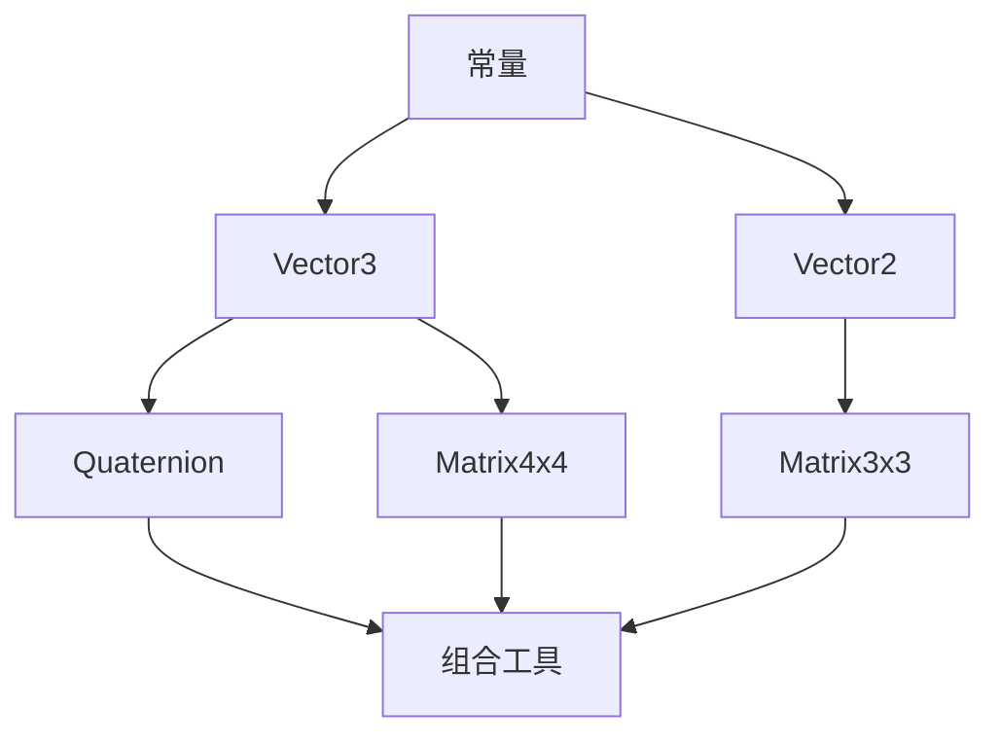

# 数学库 core/math — 规格总览

对应 Issue: [#8 引擎层数学库 core/math（Vector3/Quaternion/Matrix4x4）](https://github.com/IcySycamore/saga-core/issues/8)

## 领域

引擎层基础数学库，纯数据、无依赖（不依赖 Boost、不依赖 ECS）。是所有空间计算、渲染、网络同步的地基。

## 子任务拆分（7 个 todo）

| #   | 文件                                           | 内容                               |
| --- | ---------------------------------------------- | ---------------------------------- |
| M1  | [M1-math-constants.md](M1-math-constants.md)   | 常量与标量工具                     |
| M2  | [M2-vector3.md](M2-vector3.md)                 | 三维向量（核心）                   |
| M3  | [M3-vector2.md](M3-vector2.md)                 | 二维向量（2D 映射用）              |
| M4  | [M4-quaternion.md](M4-quaternion.md)           | 四元数（旋转）                     |
| M5  | [M5-matrix4x4.md](M5-matrix4x4.md)             | 4x4 矩阵（TRS/投影）               |
| M6  | [M6-matrix3x3.md](M6-matrix3x3.md)             | 3x3 矩阵（旋转/法线）              |
| M7  | [M7-transform-tools.md](M7-transform-tools.md) | 组合工具（lookAt/TRS/欧拉↔四元数） |

## 依赖拓扑



## 文件组织

```
core/math/
├── Math.h          # M1：常量 + 标量工具（头文件即可）
├── Vector2.h       # M3
├── Vector3.h       # M2
├── Quaternion.h    # M4
├── Matrix3x3.h     # M6
├── Matrix4x4.h     # M5
└── TransformTools.h # M7
```

全部头文件为主（模板/内联），无 .cpp。放入 `core/math/` 目录。

## 通用约束（所有 todo 适用）

- **C++20**，`constexpr` 优先，无 RTTI 依赖
- 命名空间 `math::`，与 `boost` 隔离
- 测试独立编译（只链接 Boost，遵循项目约定），放 `test/test_math.cpp`
- 修改前读相关 ADR；术语与 `CONTEXT.md` 一致
